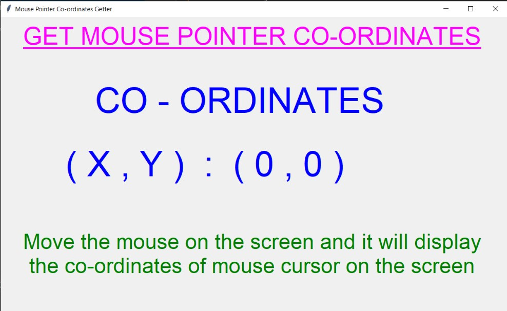
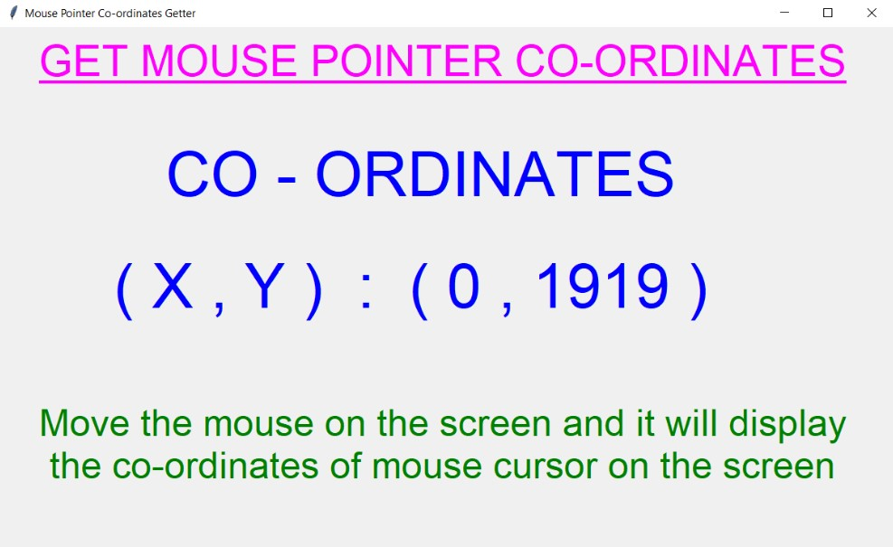
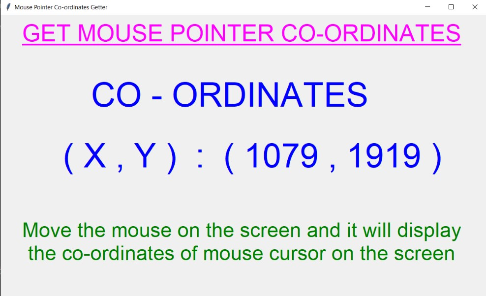
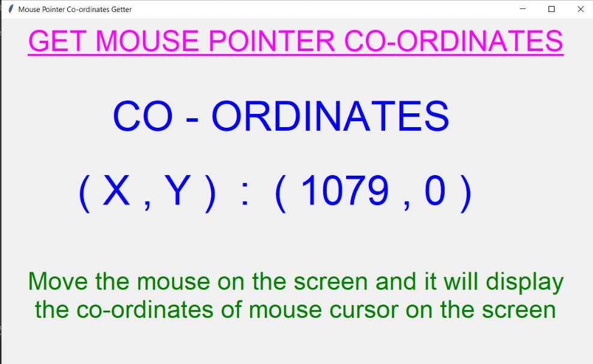
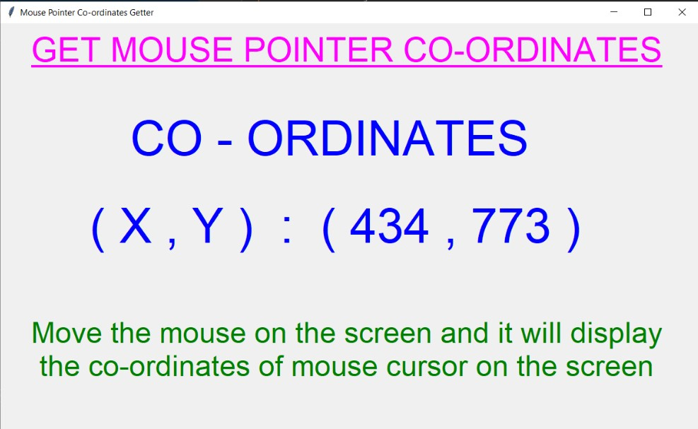
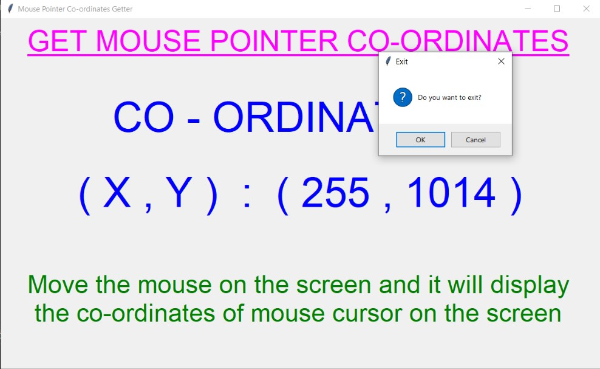

## ✔ MOUSE POINTER CO-ORDINATES GETTER
- A Mouse Pointer Co-ordinates Getter is an application created in python with tkinter gui.
- In this application, user can get the x,y co-ordinates of his/her mouse pointer on the screen.
- The co-ordinates will change accordingly as user moves the mouse.
- Using this user will also be able to see what's the height and widht of his/her PC or Computer screen. 

	
	
	
	

	
	
	
	

	
	
	
	

	
	
	
	
	
	

	

****

### 📌REQUIREMENTS :
- python 3
- tkinter module
- from tkinter messagebox module
- pyautogui

****

### 📌How this Script works :
- User just need to download the file and run the mouse_pointer_co-ordinates_getter.py on their local system.
- Now the main window of the application opens and user can move the mouse and will get the co-ordinates of each instant position of his/her mouse pointer on the screen.
- Also user can use this application to find the height and width of his/her screen of PC/computer.
- Also there is an exit button, clicking on which exit dialog box appears asking for the permission of the user for closing the window.

### 📌Purpose :
- This scripts helps us to easily get the instant position of mouse pointer on the screen.

### 📌Compilation Steps :
- Install tkinter, pyautogui
- After that download the code file, and run mouse_pointer_co-ordinates_getter.py on local system.
- Then the script will start running and get the co-ordinates as mentioned.

****

### 📌SCREENSHOTS :

   
   
   
   
   
   

****

### 🌟Stargazers Over Time:

****

### 📌Contributors:

